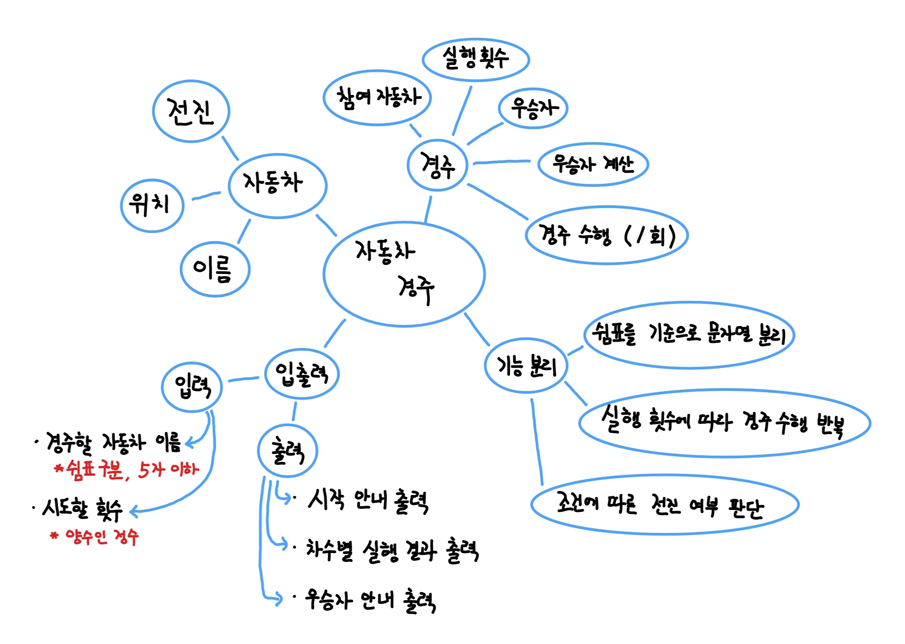

## 1️⃣ 과제 개요

**우아한 테크코스 프리코스 2주차 과제**

**과제명 : 자동차 경주**

**기간 : 10.21 ~ 10.27 (2주차)**

**작성자 : 윤돌**

 

## 2️⃣ 기능 목록

**(0) MVC 구조 세팅, 기본 파일 생성**

**(1) 경주할 자동차 이름 입력 및 검증**

**(2) 시도할 횟수 입력 및 검증**

**(3) 입력 값 기반으로 경주 초기화**

**(4) 경주 수행 로직 구현**

**(5) 실행 횟수 기반 경주 반복 및 차수별 실행 결과 출력**

**(6) 우승자 계산 및 우승자 안내 출력**

**(7) 전체 테스트 및 실행 확인**

**(8) 리펙토링**

 

## 3️⃣ 설계 과정

